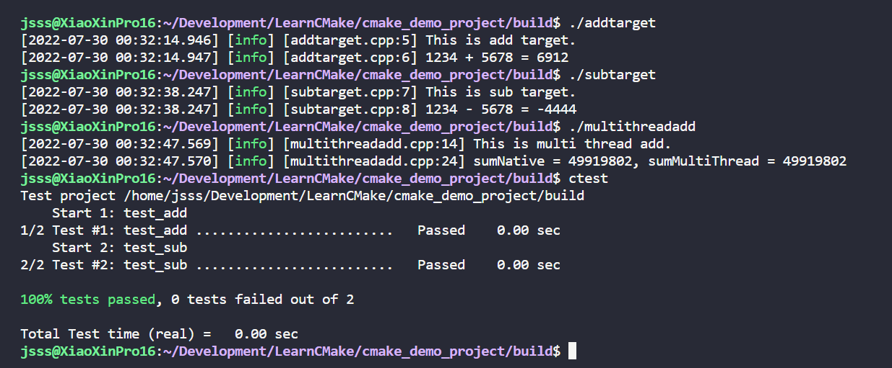

# CMake Demo Project 

[博客链接](https://csjsss.github.io/2022/07/29/cpp/%5Bcpp%5DCMake%E5%88%9D%E5%AD%A6%E5%B0%8F%E7%BB%93/)

## Run Project

### Download Project

```bash
git clone https://github.com/CsJsss/CMake-Demo-Project
```

### Download Spdlog

```bash
cd thirdparty
git clone https://github.com/gabime/spdlog.git
cd spdlog
cmake -B build
cmake --build build
```

### Build

```bash
chmod u+x build.sh
./build.sh
```

### Ctest

```bash
cd build
ctest
```

### Run Target

```bash
cd build
./addtarget 
 ./subtarget 
./multithreadadd 
```

### Results

